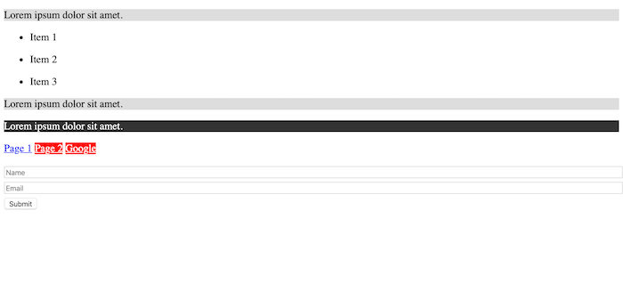
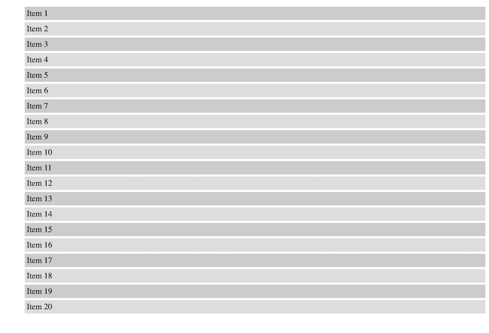
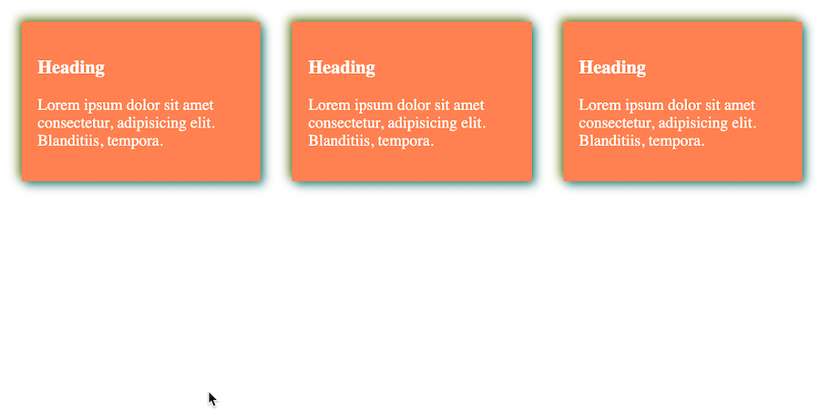

# advance-css
Advance CSS concepts.

---

## Targeted Selector

By using targetted type of selector, we can select specifi elements by relationship, such as Direct Child ` > `, Directly After ` + `, By Atttribute ` [ ] `, Specific Attribute values ` ='' `. 


```css
/* Direct child */
div > p {
    background: #ddd;
}

/* Directly after */
div + p {
    background: #333;
    color: #fff;
}

/* By attribte */
a[target] {
    background: #ff0000;
    color: #fff;
}

/* Specific attribute values */
input[type="text"], input[type="email"] {
    width: 100%;
    margin-bottom: 5px;
}
```



---

## nth-child Selector

The nth-child selctor allows us to select the child elements of the parents. It is a pseudo selector such as `:first` and `:last` to directly select from parents, but use the `nth-child()` method when select specific child elements. 

```css
li {
    padding: 0.25rem;
    margin: 0.25rem;
    list-style: none;
}

/* first-child */
li:first-child {
    background: red;
}

/* last-child */
li:last-child {
    background: red;
}

/* Position 3 */
li:nth-child(3) {
    background: purple;
}

/* Every 3rd one */
li:nth-child(3n+0) {
    background: orange;
}

/* Every 3 afer 7 */
li:nth-child(3n+7) {
    background: yellow;
}

/* Every odd */
li:nth-child(odd) {
    background: #ccc;
}

/* Every even */
li:nth-child(even) {
    background: #ddd;
}
```



---

## Before & After Pseudo Class

The `:after` selector is a **pseudo-class** that allows you to add content **after** selected element. This element is an inline elmenet.  The `:before` does the opposite.

```css
body {
    font-family: Arial, Helvetica, sans-serif;
    background: #333;
    color: #fff;
    margin: 0;
}

header {
    display: flex;
    flex-direction: column;
    justify-content: center;
    align-items: center;
    text-align: center;
    height: 100vh;
}

header:before {
    content: '';
    background: url('https://source.unsplash.com/weekly?water') no-repeat center center/cover;
    opacity: 0.3;
    position: absolute;
    top: 0;
    left: 0;
    width: 100%;
    height: 100%;
    z-index: -1;
}

header > h1 {
    font-size: 4rem;
    margin: 1rem;
}

.is-required:after {
    content: '*';
    color: red;
    padding-left: 2px;
}
```


---

## Box Shadow

Box shadow properties allows us to add shadows on our elements.

```css
.container {
    display: flex;
}

.box {
    padding: 1rem;
    margin: 1rem;
    background: coral;
    color: #fff;

    /* offset-x | offset-y | color */
    box-shadow: 10px 10px teal;

    /* offset-x | offset-y | blur-radius | color */
    box-shadow: 5px 5px 20px teal;

    /* Negative values */
    box-shadow: -5px -5px 20px teal;

    /* offset-x | offset-y | blur-radius | spread-radius | color */
    box-shadow: 3px 3px 10px 1px rgba(0, 0, 0, 0.3);

    /* inset | offset-x | offset-y | color */
    box-shadow: inset 3px 3px teal;

    /* Multiple Shadows */
    box-shadow: 3px 3px 10px teal, -3px -3px 10px olive;
}
```



---